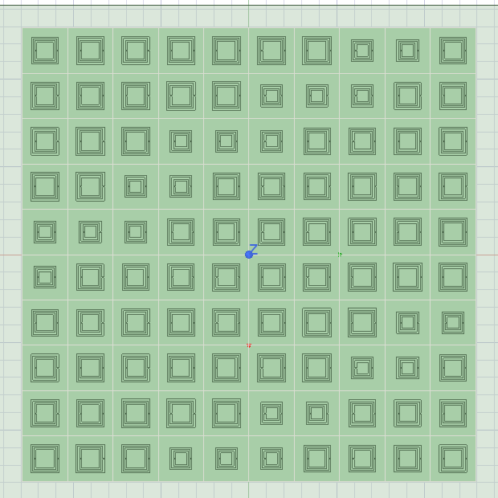
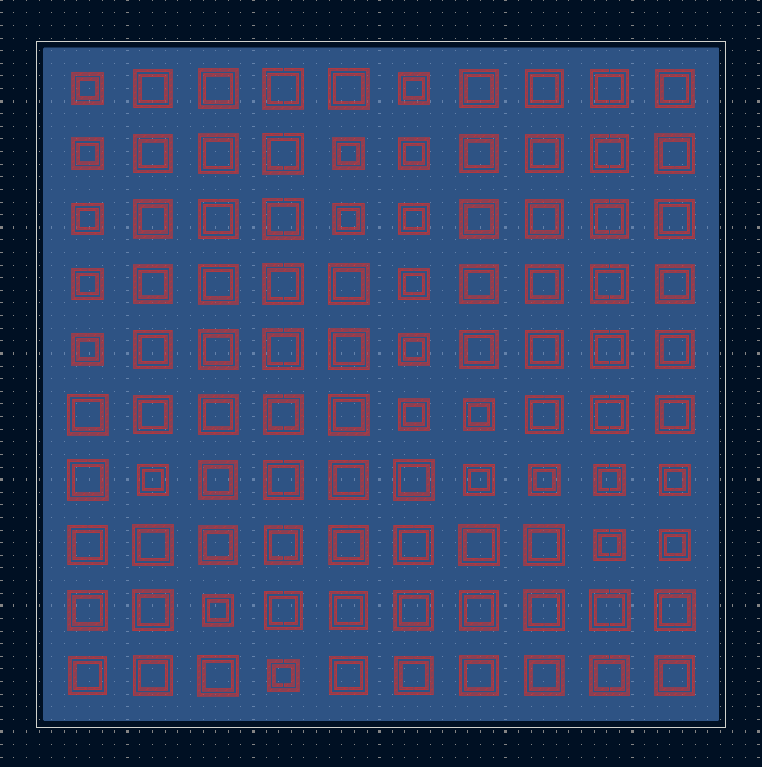
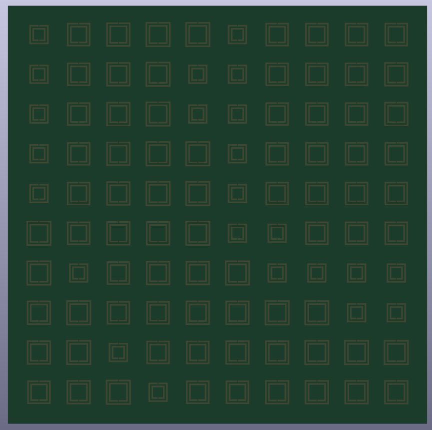

# 29GHz-Metasurface-Array-PCB
Translation of a 29 GHz metasurface array from HFSS design to a fabrication-ready PCB layout using KiCad.

# 29 GHz Metasurface 10×10 Unit Cell Array – PCB Layout

## Overview

PCB implementation of a 29 GHz metasurface unit cell. The geometry was taken from an optimized HFSS design and converted into a manufacturable layout using KiCad.

## Design Preview

### HFSS Design

### Unit Cell Geometry

### KiCad PCB Layout

## 3D View

## Workflow

* Exported unit cell geometry from HFSS (DXF)
* Imported into KiCad
* Converted into solid copper (F.Cu)
* Designed 2-layer PCB with bottom ground plane

## Details

* Frequency: 29 GHz
* Structure: Microstrip (patch + ground)
* Tools: HFSS, KiCad

## Note

This work focuses on PCB layout implementation of a pre-optimized design.
